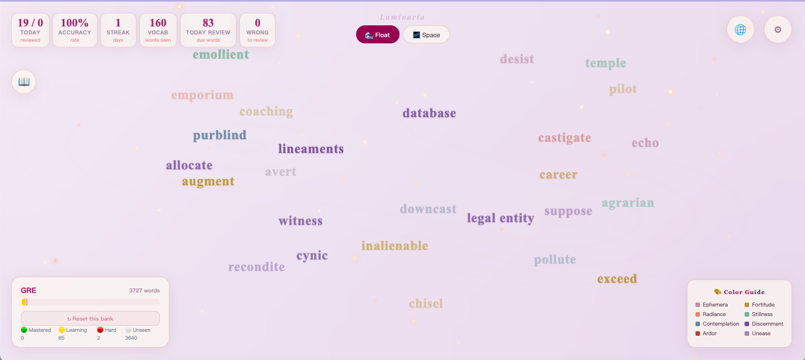
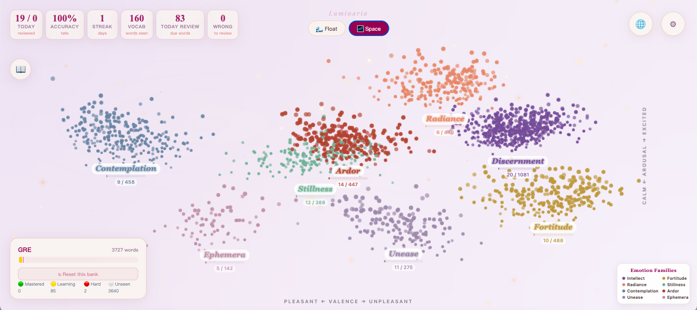

<p align="center">
  
</p>

<h1 align="center">Luminaria · 浮光词集</h1>

<p align="center">
  <strong>Vocabulary learning as an aesthetic experience.</strong><br />
  <em>10,000 AI-labeled words · 8 exam banks · FSRS · Dual-Mode Spatial Memory · Offline PWA</em>
</p>

<p align="center">
  <a href="https://onion-create.github.io/luminaria-vocab/"><strong>🌐 Live Demo</strong></a> &nbsp;&nbsp;
  <a href="LICENSE"></a>
  
  
  
</p>

---

## Why This Exists

Most vocabulary apps force an impossible choice: **scientific rigor** wrapped in a punishing interface (Anki), or **shallow engagement** dressed up as learning. Neither respects the moment of learning itself.

Luminaria starts from a different premise: **beauty is a retention mechanism, not decoration.**

Words drift across the screen in deliberate, meditative rhythm. The color palette borrows from Wes Anderson's *The French Dispatch*. The spaced-repetition engine uses FSRS — the same algorithm that outperforms Anki's SM-2 in published research. Every pixel was designed with one question: *"will this make someone stay five more minutes?"*

**Built solo, end-to-end, without a design team or engineering team.** Designed in the mind, built through AI-assisted development tools (Codex CLI, Claude Code, WorkBuddy), deployed to GitHub Pages. From idea to production — one person, zero frameworks, 100% original.

---

## What Makes It Different

### 🌊 Float Mode — Ambient Learning
Words drift across the screen in 10 distinct animation families — each dynamically assigned based on the word's AI-inferred emotional profile. Pendulum, bubble rise, dandelion, firefly, galaxy orbit — every motion is a designed experience, not a random effect. Click any word to quiz, review, and save. No gamification tricks. No streaks that punish. Just a space you want to return to.

### 🌌 Space Mode — Spatial Memory Engine
Every word becomes a star. **Ten thousand stars** organized into 8 constellations — each representing an emotional family: Discernment, Fortitude, Radiance, Stillness, Contemplation, Ardor, Unease, Ephemera. Hover reveals metadata. Click initiates learning. Each constellation tracks progress independently. Words of the same emotional profile cluster together — you learn in semantic groups, not alphabetized lists.

The rendering engine uses innerHTML batch insertion for instant loading, event delegation (3 global listeners for 2,000+ interactive elements), and GPU-composited transforms. It's fast enough to feel native.

---

## Screenshots

### Space Mode — Vocabulary Cosmos
Every word becomes a star, grouped into 8 emotional constellations. Real-time FSRS progress tracking per constellation. Click any word to learn. Bilingual UI (shown in 中文 above).



### Float Mode — Ambient Learning
Words drift across the screen with emotion-matched animations. Wes Anderson-inspired palette. Click to quiz, save to wordbook, or review.



---

## Features

| Category | What You Get |
|----------|--------------|
| 🧠 **Algorithm** | Custom FSRS implementation (stability × difficulty × retention scheduling). 25 unit tests. Outperforms SM-2. |
| 🎨 **Design System** | French Dispatch-inspired palette. 10 CSS motion-design families. Glassmorphism UI. 22 background gradients. Fixed-width bilingual layout — zero layout shift on language toggle. |
| 📚 **Content** | 34,479 words across 8 exam banks: CET-4, CET-6, 考研, TOEFL, IELTS, GRE, SAT, 商务英语. Bilingual definitions. Word bank selector with counts. |
| 🤖 **AI Halo** | 10,081 words labeled with VAD (Valence-Arousal-Dominance) emotion coordinates by DeepSeek API. Each word gets: valence, arousal, dominance, 3 emotional traits, emotion family, color, and animation preset. |
| 🔭 **Constellations** | 8 emotion-family constellations with real-time per-constellation progress bars. Progress tracking per family. Level-of-detail rendering for smooth navigation. |
| 🌐 **Bilingual** | Full English and Chinese UI with instant toggle. All labels, stats, legends, and constellation names switch in one frame — no flicker, no layout shift. |
| 📱 **PWA** | Install to home screen. Works offline — all data in localStorage. No account required. No server. No data collection. |
| 📊 **Statistics** | Daily review count, accuracy percentage, streak tracking, FSRS progress bar (Mastered / Learning / Hard / Unseen per bank), total vocabulary seen. |
| 🏆 **Achievements** | 9 milestone tiers (10 → 5,000 words) with confetti animations and celebratory messages. |
| 📖 **Wordbook** | Draggable persistent word collection. Auto-saves wrong words. Manual save for correct words. |
| 📤 **Share Card** | Canvas-rendered learning report with ring chart, 7-day bar chart, and stats cards. Download as PNG or copy to clipboard. |
| ⚡ **Performance** | Single-file HTML (2.3MB), zero framework dependencies. Event delegation (3 global listeners for 2,000+ space-mode dots). InnerHTML bulk rendering. GPU-composited transforms. Service Worker v5 for instant reload. |
| 🔧 **Engineering** | 25 FSRS unit tests. CI/CD via GitHub Actions (test → build → deploy). Modular source → single-file build pipeline. |

---

## The AI-Assisted Development Story

*This project is a case study in AI-native product development.*

Luminaria was conceived, designed, and built by one person — **袁铭 (Yuan Ming)** — with no formal software engineering background. The development stack: **Claude Code + Codex CLI + WorkBuddy** as AI engineering partners, **DeepSeek API** for the Halo emotion-labeling pipeline, and **GitHub Pages + vanilla JS** for zero-infrastructure deployment.

The methodology: design-first development. Every feature started as a product decision ("words should feel like they belong to an emotion, not a list"), was prototyped through AI pair-programming, tested manually, and shipped. No sprints. No Jira. Just a clear vision and tools that amplified execution speed.

The result: a production-grade PWA with 34,000+ words, FSRS engine, dual-mode spatial memory architecture, and a design system that could pass for a funded startup's product — built by a solo creator in weeks.

**If you're evaluating this project as a portfolio piece or hiring signal:** it demonstrates product vision, design taste, user empathy, and the ability to ship a complete product end-to-end — the exact skill set that AI-augmented teams need in 2026.

---

## Project Structure

```
luminaria-vocab/
├── index.html              # Production build — single-file PWA (2.3MB, self-contained)
├── source/
│   └── app.html           # Development source (137KB, with data placeholders)
├── scripts/
│   └── build.js           # Build script — inlines word bank + halo data
├── data/
│   ├── wb_data.json       # Word bank (34,479 entries, 1.4MB)
│   └── halo_data.json     # AI emotion labels (10,081 entries, 2.3MB)
├── tests/
│   └── fsrs.test.js       # 25 unit tests for the FSRS scheduling algorithm
├── static/
│   ├── sw.js              # Service Worker (v5, offline cache)
│   ├── manifest.json      # PWA manifest
│   └── icons/             # 10 icon sizes (32-1024px)
├── .github/workflows/
│   └── ci.yml             # CI/CD: test → build → GitHub Pages deploy
├── package.json            # Scripts: build, test, dev
├── LICENSE                 # Proprietary license
├── EULA.txt                # End User License Agreement (bilingual)
└── README.md               # This file
```

---

## Quick Start

```bash
# Clone and open — no build step needed for production
git clone https://github.com/onion-create/luminaria-vocab.git
open luminaria-vocab/index.html

# Or serve locally
python3 -m http.server 8080  # → http://localhost:8080
```

Add to your phone's home screen for a native app experience — works offline.

### Development

```bash
# Requires Node.js >= 18
npm run build     # Rebuild index.html from source/app.html + data/*.json
npm test          # Run 25 FSRS unit tests
npm run dev       # Open source/app.html directly (no data inlining)
```

---

## Attribution

- **FSRS Algorithm** — Based on [open-spaced-repetition/fsrs.js](https://github.com/open-spaced-repetition/fsrs.js). The custom implementation extends FSRS v5 with depth scoring, difficulty tracking, and per-word retention modeling. All surrounding application logic, visual identity, and curated vocabulary data are original work.
- **Typography** — Playfair Display served via Google Fonts (OFL license).
- **AI Halo Data** — VAD emotion annotations generated using the DeepSeek API.

---

## License

**Proprietary — All Rights Reserved.** See [LICENSE](LICENSE) and [EULA](EULA.txt) for full terms.

- ✅ View the source code for learning and evaluation
- ✅ Install and use for personal, non-commercial vocabulary learning
- ❌ Redistribute, modify, or use commercially without written permission

For commercial licensing or collaboration: contact the author.

---

<p align="center">
  <sub>Designed, engineered, and shipped by <strong>袁铭 (Yuan Ming)</strong><br/>
  AI-Assisted Development · © 2026 All rights reserved</sub>
</p>
